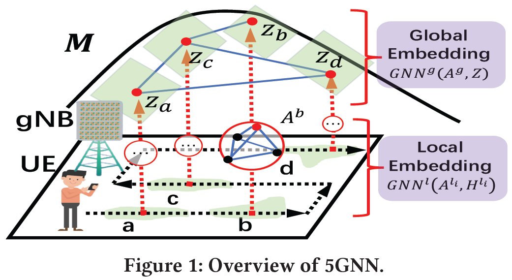
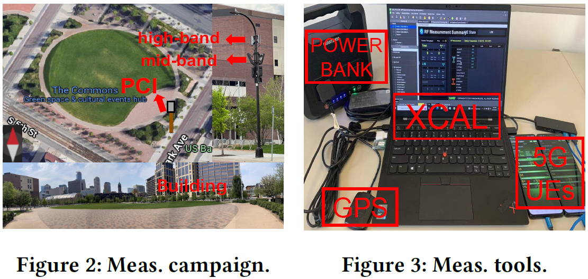

# 5GNN: Extrapolating 5G Measurements through GNNs

This repository provides materials, datasets and codes corresponding to the [CoNEXT-GNNet 2022](https://bnn.upc.edu/workshops/gnnet2022/) paper [5GNN: Extrapolating 5G Measurements through GNNs](https://dl.acm.org/doi/abs/10.1145/3565473.3569186) (Wei Ye, Xinyue Hu, Tian Liu, Ruoyu Sun, Yanhua Li, and Zhi-Li Zhang).

If you have any questions or want more (raw) datasets, please email [ye000094@umn.edu](mailto:ye000094@umn.edu) directly for quick response. 


# Introduction 

### Motivations 
The advent of 5G networks has attracted a flurry of measurement studies to understand their performance in various settings. 
Unfortunately, carrying out an in-depth measurement study of 5G is laborious and costly. 
The measurement samples cover only limited points in a (potentially large) coverage area of one or more 5G towers/base stations. 

In this work, we tackle the following basic question: given a collection of 5G “signal” measurements collected in limited locations in a target 5G coverage area, can we infer or extrapolate 5G “signals” at other locations within the area that we do not have samples?


### Proposed Method: *5GNN* 
We propose a novel learning paradigm based on graph neural networks (GNNs), dubbed *5GNN*, which captures both the “local” and “global” patterns of the underlying spatial correlation of 5G signals based on the measured data points. This paradigm is guided by insights from the physical characteristics of 5G networks.




### Commercial 5G Dataset
We conduct comprehensive measurement campaigns to collect the signal and radio channel dataset in a public square near a large football stadium in downtown Minneapolis (USA), where covered diverse 4G and 5G bands. 




# Implementation

### Structure
The folder ```code``` contains the necessary Python scripts, including program entry with hyper-parameter settings (```main.py```), neural network architecture (```model_*.py```), model training (```wrapper_*.py```), and other utility functions (```utils_*.py```).  

The folder ```data``` contains the collected datasets, including the DeepMIMO simulation data and collected commercial 5G data.

The folder ```materials``` contains other supplementary materials, such as presentation slides. 


### Dependencies
*5GNN* and other graph-based learning models are mainly built on the ```PyTorch-Geometry``` and ```PyTorch```. The baseline model *Universal Kriging* is built on ```PyKrige```.

Meanwhile, our implementation also involves other widely-used libraries, including but not limit to: ```numpy```, ```matplotlib```, ```pandas```, ```scipy```, ```scikit-learn```, ```geopandas```. They can be easily installed via ```pip``` or ```conda install```.


### Acknowledgement 
Some functions are modified from 
[PE-GNN](https://github.com/konstantinklemmer/pe-gnn).

We thank these authors for providing easy-to-use libraries or making their code publicly available. 
 


# Citation 
If you want to cite our work, you can use the following reference:
```
@inproceedings{ye20225gnn,
  title={5GNN: extrapolating 5G measurements through GNNs},
  author={Ye, Wei and Hu, Xinyue and Liu, Tian and Sun, Ruoyu and Li, Yanhua and Zhang, Zhi-Li},
  booktitle={Proceedings of the 1st International Workshop on Graph Neural Networking},
  pages={36--41},
  year={2022}
}
```

